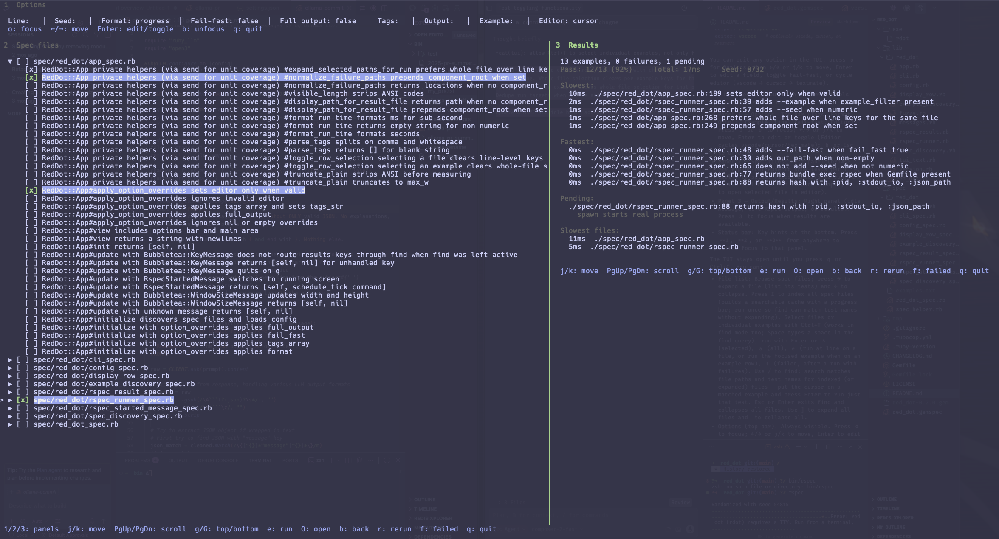

# Red Dot

A terminal UI for running RSpec tests (Inspired by VScode Test Explorer). Start it from your project directory, leave it open, and run any combination of specs whenever you want.

## Installation

Add to your Gemfile:

```ruby
gem "red_dot"
```

Or install directly:

```bash
gem install red_dot
```

### Build and install locally

To build and install the gem from source (e.g. for development or testing):

```bash
git clone https://github.com/red_dot/red_dot.git
cd red_dot
bundle install
gem build red_dot.gemspec
gem install red_dot-*.gem
```

Or install without building a `.gem` file (uses the local directory):

```bash
cd /path/to/red_dot
bundle install
gem install --local .
```

Requires Ruby 3.3+ and `bundle install` will pull in dependencies (bubbletea, lipgloss).

## Usage

**Single project**: From your project root (where your `spec/` directory lives), or from any directory with a `spec/`:

```bash
rdot
# or with a specific directory
rdot /path/to/project

# Index spec files with the following key combination:
shift + i
```

**Umbrella / component projects**: From the repo root that has a root-level `components/` directory, run `rdot` to see and run specs from the root (if it has a `spec/` dir) and from each direct child of `components/` that has a `spec/` subdirectory. Each component’s specs run in that component’s directory (using its Gemfile). You can still run `rdot` from inside a component (e.g. `cd components/auth && rdot`) for single-component mode.

### One-off options (CLI)

Override options for a single run without editing config or the TUI:

```bash
rdot --format documentation
rdot --tag slow --fail-fast /path/to/project/root
rdot -f progress -t focus -o /tmp/out.txt
```

| Option          | Short | Description                                                                                                 |
| --------------- | ----- | ----------------------------------------------------------------------------------------------------------- |
| `--format`      | `-f`  | RSpec formatter (e.g. progress, documentation)                                                              |
| `--tag`         | `-t`  | Tag filter (repeatable)                                                                                     |
| `--output`      | `-o`  | Output file path                                                                                            |
| `--example`     | `-e`  | Example filter (e.g. regex)                                                                                 |
| `--line`        | `-l`  | Line number (run single example at path:line when running one file)                                         |
| `--fail-fast`   | —     | Stop on first failure                                                                                       |
| `--full-output` | —     | After a run, show captured RSpec stdout in the results panel (same as toggling **Full output** in options). |

### Configuration

Options are merged in this order (later overrides earlier):

1. **Defaults** (see table below)
2. **User config** — `~/.config/red_dot/config.yml` (or `$XDG_CONFIG_HOME/red_dot/config.yml`)
3. **Project config** — `.red_dot.yml` in the project root
4. **CLI** — flags passed to `rdot`

All of these can be overridden via config YAML (user or project). In the TUI, press `o` to focus the options bar and edit any field (Enter to edit or toggle).

| Option      | Default    | Config key           | Notes                                                                                                                                              |
| ----------- | ---------- | -------------------- | -------------------------------------------------------------------------------------------------------------------------------------------------- |
| Tags        | _(empty)_  | `tags` or `tags_str` | RSpec tag filter. Use `tags:` (array) or `tags_str:` (string, e.g. `"~slow, focus"`).                                                              |
| Format      | `progress` | `format`             | RSpec formatter: e.g. `progress`, `documentation`.                                                                                                 |
| Output      | _(empty)_  | `output`             | File path for RSpec output. Also accepts legacy key `out_path`.                                                                                    |
| Example     | _(empty)_  | `example_filter`     | Example filter (e.g. regex) passed to RSpec.                                                                                                       |
| Line        | _(empty)_  | `line_number`        | Line number for single-file runs (path:line).                                                                                                      |
| Fail-fast   | `false`    | `fail_fast`          | Stop on first failure. Use `true` or `false`.                                                                                                      |
| Full output | `false`    | `full_output`        | Results panel shows captured RSpec stdout (scrollable) instead of the structured summary. Toggle with Enter on **Full output** in the options bar. |
| Seed        | _(empty)_  | `seed`               | RSpec random seed (e.g. `12345`) for reproducibility.                                                                                              |
| Editor      | `cursor`   | `editor`             | Editor for “open file” (O): `vscode`, `cursor`, or `textmate`.                                                                                     |

| Components | _(auto)_ | `components` | Umbrella only: list of component root paths (relative to project root). Overrides automatic discovery. Use `"."` or `""` for root, e.g. `[".", "components/auth", "apps/web"]`. |

Example `~/.config/red_dot/config.yml`:

```yaml
format: documentation
tags_str: "~slow"
fail_fast: false
editor: cursor # vscode, cursor, or textmate — path executable used when opening file (O)
```

Example `.red_dot.yml` in project root:

```yaml
format: progress
tags:
  - focus
output: /tmp/rspec.out
editor: vscode # optional: vscode, cursor, or textmate
```

You can edit any option in the TUI: press `o` for Options, then ←/→ or j/k to move, Enter to edit a field, toggle fail-fast, or cycle editor (vscode → cursor → textmate).

The TUI uses a layout with numbered panels and a shared status bar:

- **Panel 1 — Options**: Top bar (Tags, Format, Output, Example, Line, Fail-fast, Editor). Press `1` or `o` to focus; ←/→ or j/k to move, Enter to edit or toggle (Editor cycles vscode/cursor/textmate); `b` or Esc to unfocus.
- **Panel 2 — Spec files**: Left panel (browse, →/← expand/collapse to show tests per file, Ctrl+T to select files, Enter/s to run, `e` to run at line or run focused example, `O` to open selected file in editor).
- **Panel 3 — Output/Results**: Right panel (idle message, live RSpec output, or results). Press `3` to focus when results are available.
- **Status bar**: Key hints at the bottom. Press `**1`**, `**2`**, or `**3**` from anywhere to switch focus to that panel.

The TUI stays open until you press `q` or Ctrl+C. You can:

- **File list**: Browse spec files; press **→** to expand a file (list its tests) and **←** to collapse. Press **I** to **index** all spec files (builds a searchable cache with a progress bar; run once so find can match test names without expanding). Select files or individual examples with **Ctrl+T** (works in find mode too; Space types a space in the find query), run with Enter or `s` (selected), `a` (all), `e` (run at line on a file, or run the focused example when on an example row), `f` (failed, after a run with failures). Use **/** to find; search matches file paths and test names for indexed (or expanded) files — put the cursor on a matched example and press Enter to run just that test. **Esc** or **Enter** exits find and collapses all files. Use **]** to expand all files and to collapse all.
- **Options** (top bar): Always visible. Press `o` to focus; ←/→ or j/k to move, Enter to edit a field or toggle fail-fast; `b` or Esc to unfocus.
- **Running**: See live RSpec output in the right panel. Press `**3`** to focus the output pane (if you switched to the file list). Use **j/k**, **PgUp/PgDn**, **g/G** to scroll the output; `**2`** to switch back to the file list. Press `**q`** to kill the run and return to the file list.
- **Results**: In the right panel; j/k to move over failures, `e` to run that single example (path:line), `O` to open that file in your configured editor, `r` to rerun same scope, `f` to rerun only failed examples.

### Key bindings

| Key     | Action                                                                                      |
| ------- | ------------------------------------------------------------------------------------------- |
| **1**   | Focus panel 1 (Options)                                                                     |
| **2**   | Focus panel 2 (Spec files)                                                                  |
| **3**   | Focus panel 3 (Output/Results when results exist; Running output when a run is in progress) |
| q / Esc | Quit                                                                                        |

| Key     | Action (file list — panel 2)                                                                 |
| ------- | -------------------------------------------------------------------------------------------- |
| j / ↓   | Move down                                                                                    |
| k / ↑   | Move up                                                                                      |
| →       | Expand file (show its tests)                                                                 |
| ←       | Collapse file (or move to parent file and collapse)                                          |
| ]       | Expand all files                                                                             |
| [       | Collapse all files                                                                           |
| Ctrl+T  | Toggle selection (file or expanded example row; use in find mode too)                        |
| Enter   | Run selected (or current file/example if none selected)                                      |
| a       | Run all specs                                                                                |
| s       | Run selected specs                                                                           |
| e       | Run at line (prompt for line number on a file) or run this example (when on an example row)  |
| O       | Open selected file (or example’s file at line) in configured editor (vscode/cursor/textmate) |
| f       | Run failed only (after a run with failures)                                                  |
| I       | Index all spec files (build cache for find; shows progress bar)                              |
| o       | Focus options (panel 1)                                                                      |
| R       | Refresh file list                                                                            |
| q / Esc | Quit                                                                                         |

| Key            | Action (options bar — panel 1)                                         |
| -------------- | ---------------------------------------------------------------------- |
| 2              | Focus panel 2 (Spec files)                                             |
| ← / → or j / k | Move between fields                                                    |
| Enter          | Edit field, toggle fail-fast, or cycle editor (vscode/cursor/textmate) |
| b / Esc        | Unfocus options, back to file list                                     |
| q              | Quit                                                                   |

| Key         | Action (running output — panel 3, during a run)   |
| ----------- | ------------------------------------------------- |
| j / k       | Scroll output up/down                             |
| PgUp / PgDn | Page scroll                                       |
| g / G       | Jump to top/bottom of output                      |
| 2           | Switch to file list (run continues in background) |
| q           | Kill run and return to file list                  |

| Key         | Action (results — panel 3)          |
| ----------- | ----------------------------------- |
| j / k       | Move between failed examples        |
| e           | Run this example only (path:line)   |
| O           | Open this file in configured editor |
| 2 / b / Esc | Back to file list                   |
| r           | Rerun same scope                    |
| f           | Rerun failed only                   |
| q           | Quit                                |

## Requirements

- Ruby 3.3+
- A terminal (TTY)
- RSpec in your project (the gem invokes `bundle exec rspec` or `rspec` via the CLI)

## License

MIT
